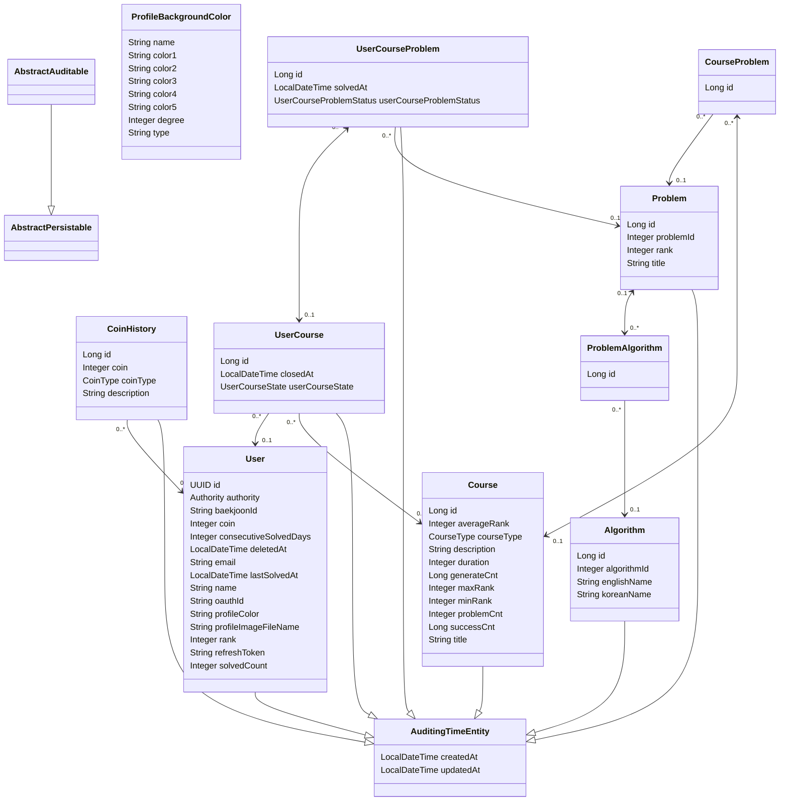

# OPEN-ALOC 🧩
[](https://www.openaloc.store/)

**OPEN-ALOC은 백준 알고리즘 문제를 기반으로 한 맞춤형 알고리즘 학습 웹 서비스입니다.**

DEADLINE, DAILY 등 다양한 학습 유형과 폭넓은 난이도·주제를 아우르는 문제 코스를 제공하며, 사용자는 최대 3개의 코스를 선택해 자신의 학습 스타일에 맞게 알고리즘을 체계적으로 학습할 수 있습니다.

**초보자부터 실력 향상을 원하는 개발자까지, 모든 알고리즘 학습자를 위한 플랫폼입니다.**


## 🛠 기술 스택
- Language: Java 17
- Framework: Spring Boot
- Database: PostgreSQL
- Infra: AWS EC2, RDS, Docker, Github Actions
- Auth: OAuth2, JWT

## ✨ 주요 기능 (Features)

- 🔐 **회원 인증 및 관리**  
  OAuth2 로그인과 JWT 기반 토큰 인증으로 안정적인 사용자 인증을 제공합니다.

- 📚 **맞춤형 알고리즘 학습 코스**  
  DEADLINE / DAILY 유형으로 구성된 다양한 주제·난이도의 코스를 제공하며, 사용자는 최대 3개의 코스를 선택해 병행 학습이 가능합니다.

- 🧩 **DEADLINE / DAILY 학습 유형**
  - **DAILY**: 하루에 한 문제씩 순차적으로 공개되며, 이전 문제를 풀어야 다음 문제가 열립니다. 꾸준한 학습 루틴 형성을 도와줍니다.
  - **DEADLINE**: 모든 문제를 기한 내에 풀어야 하며, 각 문제는 순차적으로 잠금 해제됩니다. 집중력 있는 단기 학습을 유도합니다.

- ✅ **문제 풀이 및 코스 진행 관리**  
  사용자는 문제 풀이 내용을 기록하고, 각 코스의 진행 상황을 체계적으로 관리할 수 있습니다.

- ⏰ **데드라인 기반 일정 관리**  
  DEADLINE 유형은 마감일 기반으로 학습 일정을 설정해 사용자에게 일정한 학습 리듬을 제공합니다.

- 💰 **코인 보상 시스템**  
  문제 풀이, 코스 완료, 연속 학습일이 7의 배수일 때마다 코인을 지급하여 꾸준한 학습을 유도합니다.

- 🎨 **코인 상점 기능**  
  획득한 코인으로 프로필 색상을 변경할 수 있는 상점을 통해 사용자 커스터마이징을 지원합니다.

- 📊 **개인 통계 시각화**  
  문제 풀이 수, 진행 중인 코스 현황, 달성률 등의 데이터를 시각적으로 확인할 수 있습니다.


## 📁 프로젝트 구조


```
📂 main
┣ 📂 java
┃ ┗ 📂 com.aloc.aloc
┃ ┣ 📂 algorithm — 알고리즘 관련 도메인
┃ ┣ 📂 auth — 로그인, 인증, JWT 토큰 처리 등
┃ ┣ 📂 coin — 코인 지급 정책 및 상점 기능
┃ ┣ 📂 course — 학습 코스 관리 (DAILY / DEADLINE 유형 포함)
┃ ┣ 📂 global — 공통 설정 및 유틸 (예: JWT, Config, API 응답 포맷 등)
┃ ┣ 📂 problem — 문제 도메인 및 풀이 기록, 정책, 공개 순서 로직 등
┃ ┣ 📂 profilebackgroundcolor — 프로필 색상 관련 기능 (상점에서 구매한 색상 관리)
┃ ┣ 📂 scheduler — 스케줄러 (코인 지급, 데일리 문제 오픈 등 자동 작업)
┃ ┣ 📂 scraper — 크롤링 로직
┃ ┣ 📂 user — 사용자 도메인 (유저 정보, 통계, 프로필 등)
┃ ┗ 📂 webhook — 외부 연동용 Webhook 처리

┗ 📂 resources — 설정 파일 (e.g. application.yml) 및 정적 자원

```

## 🗂 ERD
<details> <summary>클릭해서 ERD 보기👀</summary>


